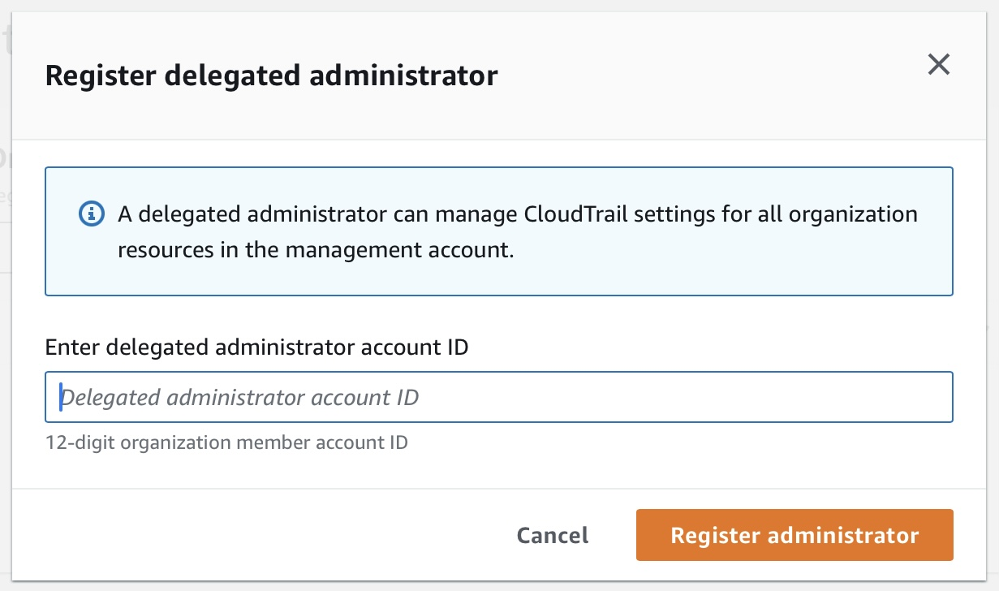

# expedition

CloudTrail Lake configuration happens in the management account to enable logging for all accounts in the organization. Apply the ```expedition``` tag to identify the event data store to be monitored. The permissions bundle also needs to be deployed in the management account. Create a new account or pick a secured account with alternate contacts configured for the **Expedition** deployment.

### Register Delegated Administrator



### Create Event Data Store


